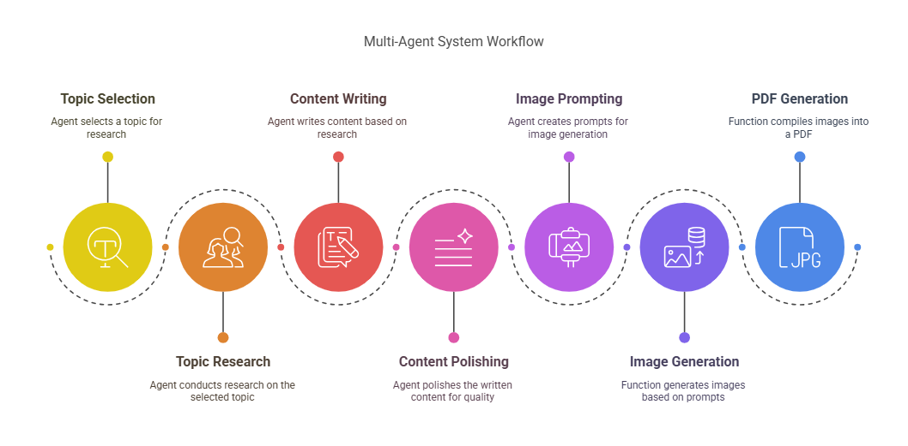

# Linkedin Content Automation Agent

## Overview
LinkedIn Agent is an AI-powered automation tool built with CrewAI that leverages multiple agents to perform automated content creation. The system utilizes Google's Gemini 1.5 Pro model for natural language processing capabilities and includes features for web scraping, PDF report generation, and data analysis.

## Features
- Multi-agent collaboration using CrewAI framework
- Web scraping capabilities for LinkedIn data collection
- Image Generation from text prompts
- PDF report generation with emoji support
- Integration with search APIs via SerperDevTool
- Customizable agents and tasks

## Setup Requirements
-  Python 3.x environment (Google Colab recommended for simplicity)
-  Google Vertex AI API credentials (JSON file)
-  Set your SERPER API key as an environment variable:
    os.environ["SERPER_API_KEY"]="SERPER_API_KEY"
-  Set your ClipDrop API key as an environment variable:
     os.environ["CLIPDROP_API_KEY"]="CLIPDROP_API_KEY"
-  Intsall required Python packages (see requirements.txt)

## Installation
1. Clone or download this repository
2. Install the required packages: `pip install -r requirements.txt`
3. Place your Google Vertex AI credentials JSON file in an accessible location
4. Open the Jupyter notebook in Google Colab or your preferred environment

## Usage
1. Update the file path to your credentials JSON file
2. Execute the notebook cells in sequence
3. Follow any prompts for customizing the LinkedIn automation tasks
4. Review the generated PDF outputs

## Dependencies
- Python 3.x
- ReportLab (for PDF generation)
- Requests (for API calls)
- Pillow (PIL) (for image processing)
- Crew (for agent building) 
- JSON (built-in module)

## File Description
- polished_output.json: Contains the structured JSON output with headings and content for each slide.
- Start.pdf: The final PDF slideshow generated by the notebook.
- image_#.png: Generated images from text prompts (if applicable).

## Important Security Notice
This notebook contains API credentials. Never share your notebook with credentials included. If using version control, ensure credentials are properly excluded using .gitignore.

## Acknowledgments
- CrewAI for the multi-agent framework
- Google for the Gemini 1.5 Pro model
- ReportLab for PDF generation capabilities

## Contact
For any questions or issues, please reach out to [Raviraj Gaikar](https://www.linkedin.com/in/raviraj-gaikar-05a986212/) or refer to the documentation within the notebook.

Link to [Colab Notebook](https://colab.research.google.com/drive/1T7CQxqFRP3XkBIaoZLsvXahDp1nrsUmT?usp=sharing)

Enjoy using the Linkedin Content Automation Agent Notebook!

